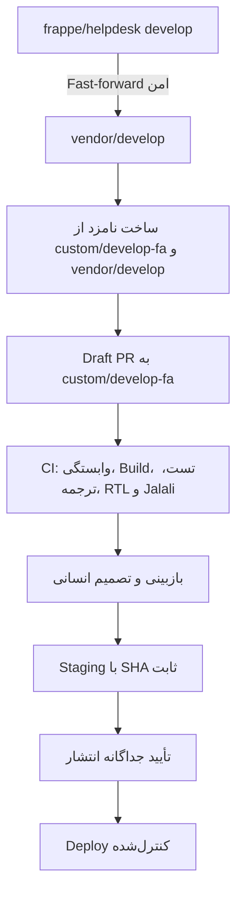

# راهبرد شاخه‌های Helpdesk فارسی

تاریخ بازبینی: ۱۰ اکتبر ۲۰۲۶

## دامنه فعلی

در این مرحله فقط خط توسعه مبتنی بر Frappe 17 نگهداری می‌شود. `custom/develop-fa` شاخه اصلی توسعه محصول فارسی است و `vendor/develop` فقط نسخه رسمی `frappe/helpdesk:develop` را نگه می‌دارد. شاخه‌های دیگر موجود می‌مانند؛ این راهبرد آن‌ها را حذف یا بازنویسی نمی‌کند.

| شاخه | نقش |
|---|---|
| `custom/develop-fa` | توسعه Helpdesk فارسی؛ ادغام تغییرات رسمی فقط با PR بررسی‌شده |
| `vendor/develop` | آینه رسمی Upstream؛ به‌روزرسانی فقط با Fast-forward |
| `develop` | شاخه پیش‌فرض مخزن؛ تغییر سیاست یا محتوا فقط از مسیر PR و با تأیید مالک |
| `feat/persian-setup-wizard` | شاخه موجود که PR شماره ۱ از آن قبلاً Merge شده؛ نگه داشته می‌شود |
| `main`, `main-hotfix`, `legacy`, `vendor/*` دیگر | شاخه‌های تاریخی/موجود؛ در دامنه توسعه فعلی نیستند و حذف نمی‌شوند |

در بازبینی فعلی، `custom/develop-fa` و `feat/persian-setup-wizard` روی SHA `5850f8a5dab1a860576de566632daced1c6f5f7c` بودند. `vendor/develop` روی `075edde1c072037f50fa73fed4141de0b05097cb` بود؛ این SHA با Upstream دیده‌شده هم‌تراز بود. این مقادیر Snapshot هستند و پیش از انتشار بعدی باید دوباره خوانده شوند.

Frappe توسعه‌ای متناظر با Helpdesk `develop` است. در مخزن فعلی سورس Frappe روی SHA `5b9f9e57232612b092b0dc0bf05dcec78bf4997d` پین شده است. `pyproject.toml` محدوده سازگاری را روی Frappe 17 و Python 3.14 محدود می‌کند؛ فایل ref، SHA دقیق سورسی را که patchهای Frappe UI بر آن اعتبارسنجی شده‌اند مشخص می‌کند.

## جریان آپدیت

هیچ ادغام خودکار به `custom/develop-fa` و هیچ Deploy خودکاری وجود ندارد. Conflict یا شکست CI نامزد را متوقف می‌کند. درخواست تغییر شاخه پیش‌فرض یا Merge به `develop` نیازمند تأیید صریح است.

## کار روزمره

توسعه‌دهندگان محصول فارسی روی `custom/develop-fa` کار می‌کنند. تغییرات رسمی ابتدا فقط در `vendor/develop` منعکس می‌شوند و سپس در Draft PR جداگانه به `custom/develop-fa` پیشنهاد می‌شوند. Frappe/Helpdesk 16 و شاخه پایدار فارسی در دامنه فعلی نیستند.
