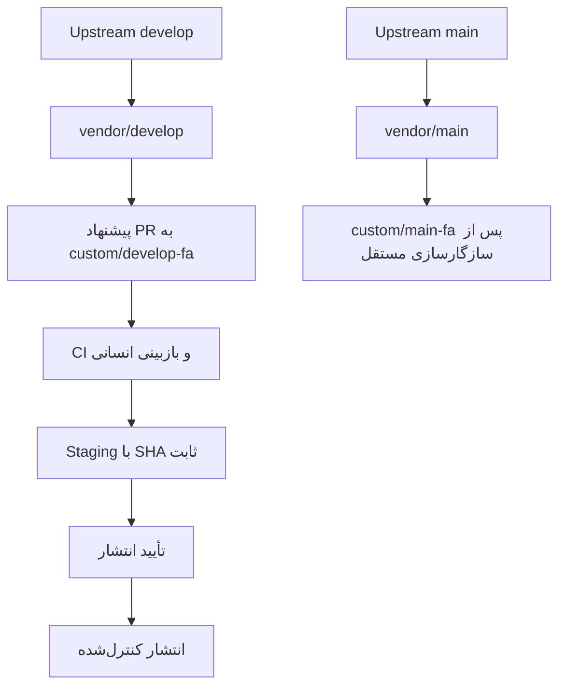

# راهبرد شاخه‌های Helpdesk فارسی

تاریخ ممیزی: ۹ اکتبر ۲۰۲۶

## وضعیت فعلی

| شاخه | وضعیت مشاهده‌شده | کاربرد |
|---|---|---|
| `main` | هم‌تراز `upstream/main`، نسخه 1.30.1 | خط پایدار رسمی |
| `main-hotfix` | هم‌تراز `upstream/main-hotfix` | اصلاح‌های نسخه پایدار |
| `develop` | ۵ Commit جلوتر و ۱۰ Commit عقب‌تر از `upstream/develop` | شاخه پیش‌فرض Fork و Base مربوط به PR فعلی |
| `legacy` | هم‌تراز `upstream/legacy` | نگهداری خط قدیمی |
| `vendor/main` | هم‌تراز `upstream/main` | Mirror پایدار؛ بدون تغییر اختصاصی |
| `vendor/main-hotfix` | هم‌تراز `upstream/main-hotfix` | Mirror اصلاح‌های نسخه پایدار |
| `vendor/develop` | هم‌تراز `upstream/develop` در Remote | Mirror توسعه |
| `vendor/legacy` | هم‌تراز `upstream/legacy` | Mirror خط قدیمی |
| `custom/develop-fa` | ۱۷۹ Commit جلوتر و ۱۰ Commit عقب‌تر از `upstream/develop`، بر پایهٔ Merge Base=`794c7b0895eb4b1ac652f6817d69d3879faef844` | نسخه فارسی توسعه؛ به‌روزرسانی نیازمند Proposal و بازبینی است |
| `custom/main-fa` | وجود ندارد | تا اثبات سازگاری ایجاد/اعلام نمی‌شود |
| `feat/persian-setup-wizard` | PR شماره ۱؛ شاخه فعال فارسی‌سازی و تغییرات وابستگی | شاخه تغییرات فارسی فعلی |

Default Branch روی `develop` باقی می‌ماند؛ تغییرش تا آماده‌شدن خط پایدار فارسی انجام نمی‌شود. `main` و `develop` دو خط مستقل‌اند: وابستگی Helpdesk در `main` به Frappe 15/16 و Python 3.10+ محدود است، در حالی که `develop` به Frappe 16/17 و Python 3.14 نیاز دارد.

در ممیزی ۹ اکتبر ۲۰۲۶، تاریخچه‌های `upstream/main` و `upstream/develop` از Merge Base `536d06681ffbb31ea5a770a5340294c12825c714` به‌ترتیب ۲۶۰۸ و ۳۵۴۲ Commit یکتا داشتند. `custom/develop-fa` از Merge Base `794c7b0895eb4b1ac652f6817d69d3879faef844` مشتق شده است؛ این شاخه ۱۱۹ Commit جلوتر و ۱۰ Commit عقب‌تر از `upstream/develop` است. هیچ Merge بین `main` و `develop` انجام نشده است.

## جریان نگهداری

Mirrorهای `vendor/*` فقط با Fast-forward به‌روزرسانی می‌شوند. شاخه‌های فارسی با Merge یا PR مستقل، بدون Force Push و بدون ادغام متقاطع `main` و `develop` نگهداری می‌شوند. CI و ساخت Proposal به‌تنهایی مجوز Merge یا Deploy نیستند.
